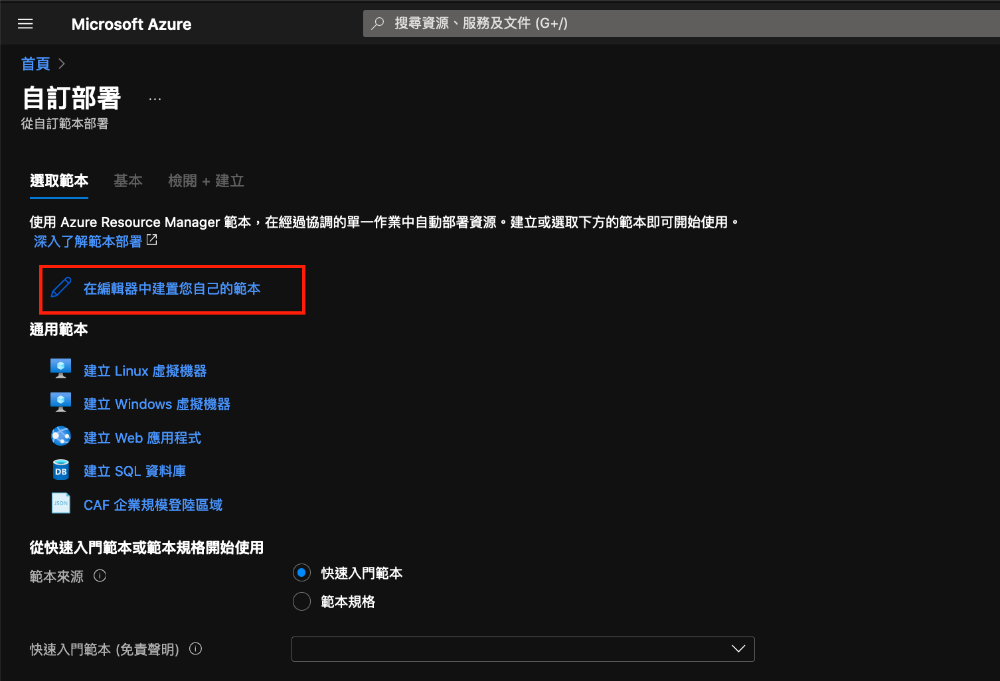

# Quickstart: Create ARM templates with Visual Studio Code

[快速入門：使用 Visual Studio Code 建立 ARM 範本](https://docs.microsoft.com/zh-tw/azure/azure-resource-manager/templates/quickstart-create-templates-use-visual-studio-code?tabs=CLI)

## 1. Create an ARM template

使用 Visual Studio Code 建立並開啟名為 azuredeploy.json 的新檔案。 在程式碼編輯器中輸入 arm，以起始用於建立 ARM 範本 Scaffolding 的 Azure Resource Manager 程式碼片段。

選取 arm! 以建立 Azure 資源群組部署範圍內的範本。

## 2. 新增 Azure 資源、範本參數與變數等

擴充功能包含許多適用於 Azure 資源的程式碼片段。 這些程式碼片段可讓您輕鬆地將資源新增至範本部署。

請參考 [templates](https://github.com/kaka-lin/azure-notes/tree/master/arm-template/templates) 資料夾。

## 3. 部署範本

部署範本至你想部署的`Resource Group`，如下所示

### 1. Azure CLI

```bash
$ az deployment group create \
--resource-group <GROUP_NAME > \
--template-file azuredeploy.json
```

### 2. Azure Portal

進入 [Microsoft Azure/自訂部署](https://portal.azure.com/#create/Microsoft.Template) 並點選`"在編輯器中建置您自己的範本"`，將您的範本貼上並儲存即可


