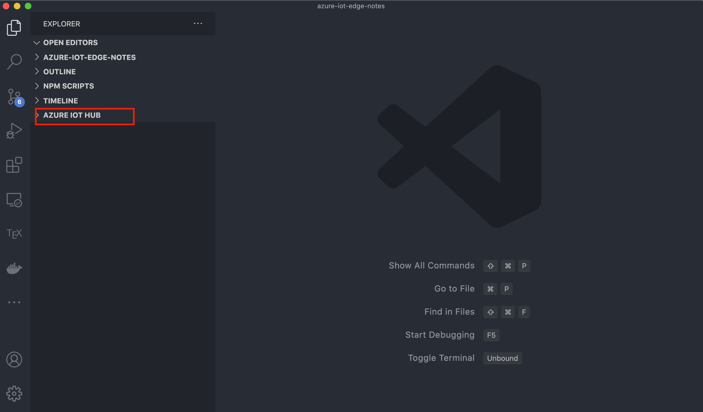
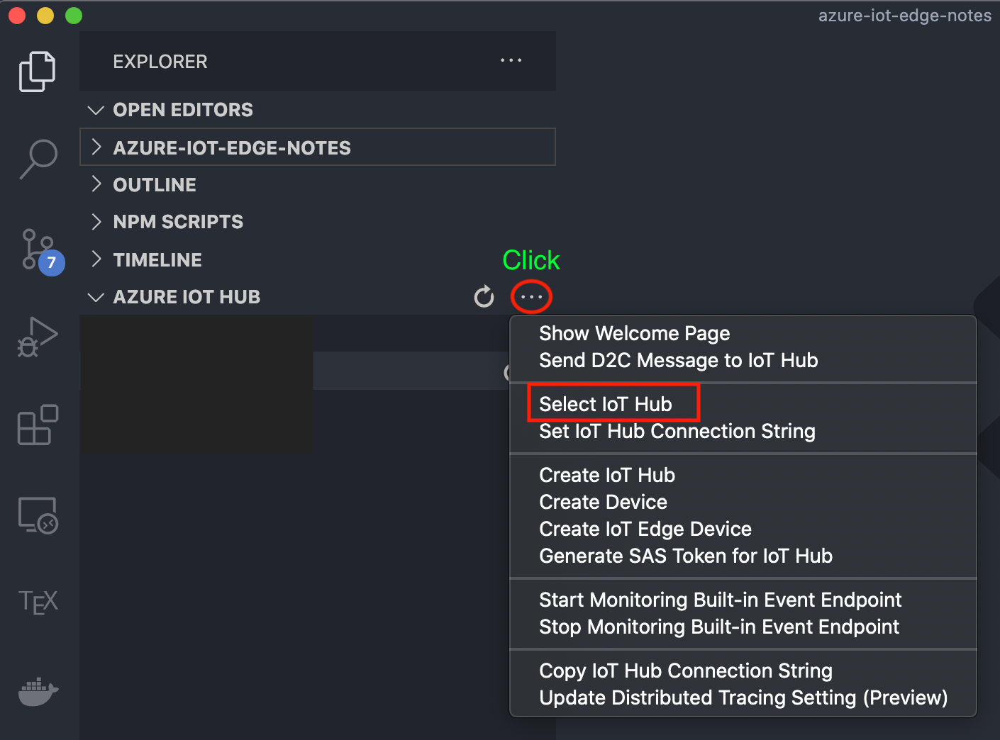
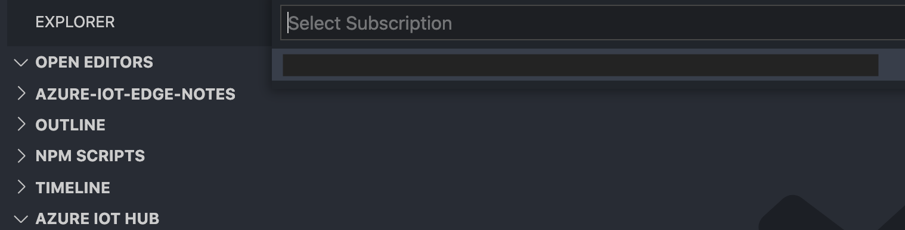
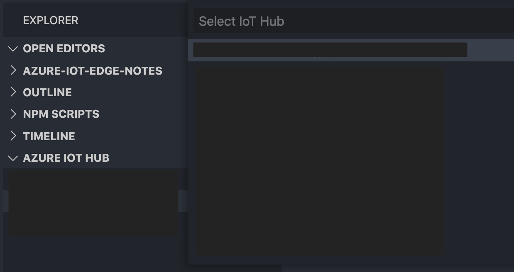
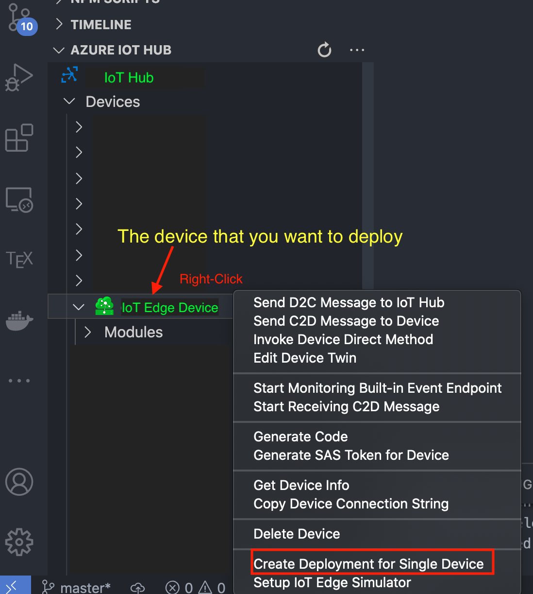
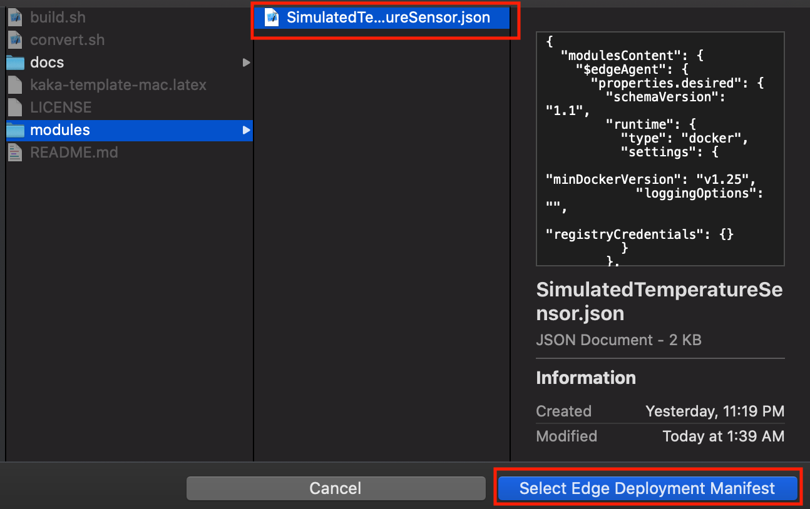
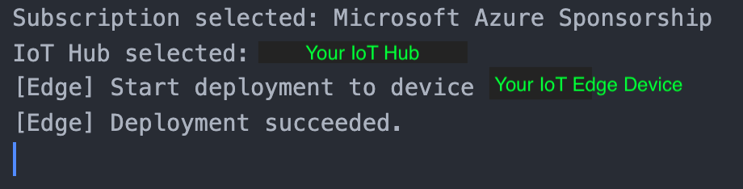
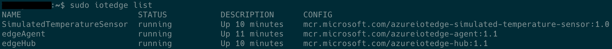

# Deploy Azure IoT Edge modules from Visual Studio Code

This section shows how to create a JSON deployment manifest, then use that file to push the deployment to an IoT Edge device.

## Prerequisites

- An `IoT hub` in your Azure subscription.
- An `IoT Edge device`
- [Visual Studio Code](https://code.visualstudio.com/)
- [Azure IoT Tools for Visual Studio Code](https://marketplace.visualstudio.com/items?itemName=vsciot-vscode.azure-iot-tools#overview)

## 1. Configure a deployment manifest

A *`deployment manifest`* is a `JSON document` that describes *which modules to deploy*, *how data flows between the modules*, and *desired properties of the module twins*.

To deploy modules using Visual Studio Code, save the deployment manifest locally as a .JSON file.

Here's a basic deployment manifest with one module as an example:

```json
{
  "modulesContent": {
    "$edgeAgent": {
      "properties.desired": {
        "schemaVersion": "1.1",
        "runtime": {
          "type": "docker",
          "settings": {
            "minDockerVersion": "v1.25",
            "loggingOptions": "",
            "registryCredentials": {}
          }
        },
        "systemModules": {
          "edgeAgent": {
            "type": "docker",
            "settings": {
              "image": "mcr.microsoft.com/azureiotedge-agent:1.1",
              "createOptions": "{}"
            }
          },
          "edgeHub": {
            "type": "docker",
            "status": "running",
            "restartPolicy": "always",
            "settings": {
              "image": "mcr.microsoft.com/azureiotedge-hub:1.1",
              "createOptions": "{\"HostConfig\":{\"PortBindings\":{\"443/tcp\":[{\"HostPort\":\"443\"}],\"5671/tcp\":[{\"HostPort\":\"5671\"}],\"8883/tcp\":[{\"HostPort\":\"8883\"}]}}}"
            }
          }
        },
        "modules": {
          "SimulatedTemperatureSensor": {
            "version": "1.0",
            "type": "docker",
            "status": "running",
            "restartPolicy": "always",
            "settings": {
              "image": "mcr.microsoft.com/azureiotedge-simulated-temperature-sensor:1.0",
              "createOptions": "{}"
            }
          }
        }
      }
    },
    "$edgeHub": {
      "properties.desired": {
        "schemaVersion": "1.1",
        "routes": {
            "route": "FROM /messages/* INTO $upstream"
        },
        "storeAndForwardConfiguration": {
          "timeToLiveSecs": 7200
        }
      }
    },
    "SimulatedTemperatureSensor": {
      "properties.desired": {}
    }
  }
}
```
## 2. Sign in to access your IoT hub

You can use the Azure IoT extensions for Visual Studio Code to perform operations with your IoT hub

1. Click the `Azure IoT Hub` section

    

2. Choose `Select IoT Hub`

    

3. Select your `Azure subscription`

    

4. Select your `IoT hub`

    

## 3. Deploy to your device

You deploy modules to your device by applying the deployment manifest that you configured with the module information

1. In the Visual Studio Code explorer view, expand the `Azure IoT Hub` section, and then expand the `Devices` node

2. *Right-click* on the IoT Edge device that you want to configure with the deployment manifest

3. Select `Create Deployment for Single Device`

    

4. Navigate to the deployment `manifest JSON file that you want to use`, and click `Select Edge Deployment Manifest`

    

5. The results of your deployment are printed in the VS Code output

    

## 4. View modules on your device

Once you've deployed modules to your device, you can view all of them in the Azure IoT Hub section. Select the arrow next to your IoT Edge device to expand it. All the currently running modules are displayed.

If you recently deployed new modules to a device, hover over the Azure IoT Hub Devices section header and select the refresh icon to update the view.

Right-click the name of a module to view and edit the module twin.

```bash
$ sudo iotedge list
```


