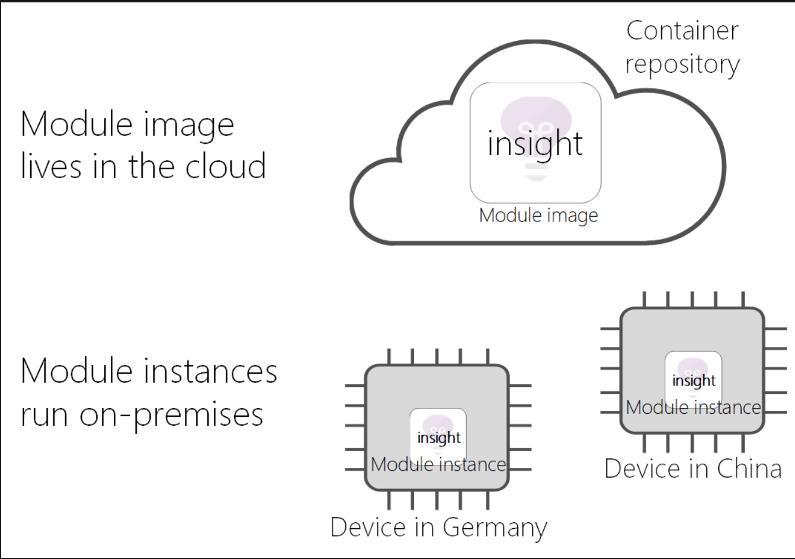
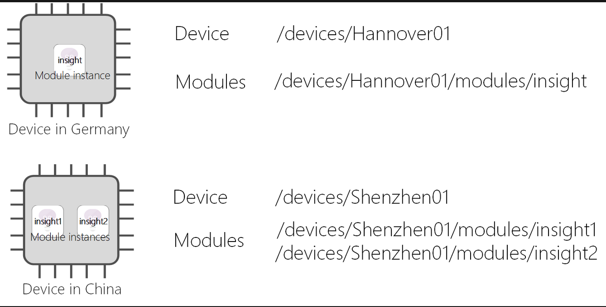

# Understand Azure IoT Edge modules

`Azure IoT Edge` 可讓您以 *模組* 形式部署和管理邊緣的商務邏輯

`Azure IoT Edge 模組`是 IoT Edge 管理的`最小計算單位`，可包含 Azure 服務 (例如 Azure 串流分析) 或您自己的解決方特定程式碼

- `A module image`: is a `package` *containing the software that defines a module*.
- `A module instance`: is the specific `unit of computation` *running the module image on an IoT Edge device*. The module instance is started by the IoT Edge runtime.
- `A module identity`: is a `piece of information` (including security credentials) stored in IoT Hub, that is associated to each module instance.
- `A module twin`: is a `JSON document` stored in IoT Hub, that *contains state information for a module instance, including metadata, configurations, and conditions.*

## Module images and instances

`IoT Edge module images` 包含應用程式，該應用程式會利用 IoT Edge 執行階段的管理、安全性和通訊功能。

每次模組映像部署至裝置並且由 IoT Edge 執行階段啟動時，就會建立該`模組的新執行個體 (a new instance of that module)`。

In implementation, modules images exist as container images in a repository, and module instances are containers on devices.

## Module identities

當 IoT Edge 執行時間建立新的模組實例時，它會取得對應的模組身分識別。 模組身分識別會儲存在 IoT 中樞，並做為該模組實例所有本機和雲端通訊的定址和安全性範圍。

與模組執行個體相關聯的身分識別取決於在其上執行執行個體的裝置身分識別，以及您提供給解決方案中該模組的名稱。例如，如果您將使用 Azure 串流分析的模組稱為 `insight`，並且在稱為 `Hannover01` 的裝置上部署，IoT Edge 執行階段會建立稱為 /`devices/Hannover01/modules/insight` 的對應模組身分識別。

## Module twins (模組對應項)

每個模組執行個體也有對應的模組對應項，您可以用來設定模組執行個體。 執行個體和對應項是透過模組身分識別彼此相互關聯。

`模組對應項是 JSON 文件`，*它會儲存模組資訊和設定屬性*。 這個概念與 IoT 中樞的裝置對應項概念相同。 模組對應項的結構與裝置對應項相同。 用來與這兩種對應項互動的 API 也相同。 兩者之間唯一的差別是用來具現化用戶端 SDK 的身分識別。

## Offline capabilities (離線功能)

在與 IoT 中樞同步處理之後，Azure IoT Edge 模組可以無限期地離線運作。 IoT Edge 裝置也可以將此離線功能延伸至其他 IoT 裝置。 如需詳細資訊，請參閱[了解適用於 IoT Edge 裝置、模組及子裝置的擴充離線功能](https://docs.microsoft.com/zh-tw/azure/iot-edge/offline-capabilities?view=iotedge-2018-06)。
