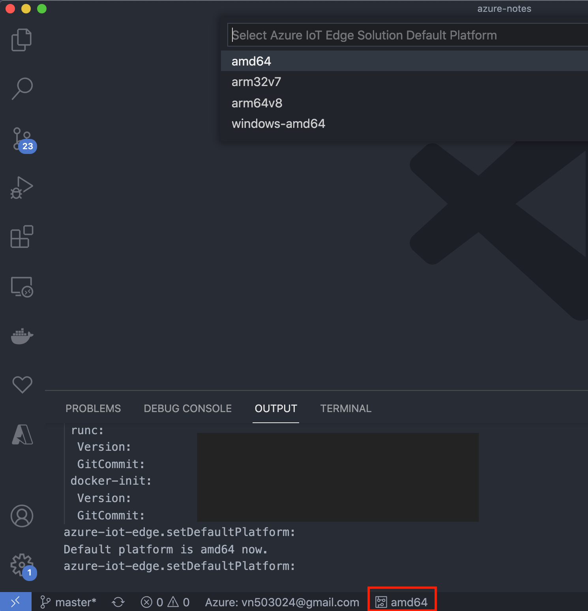
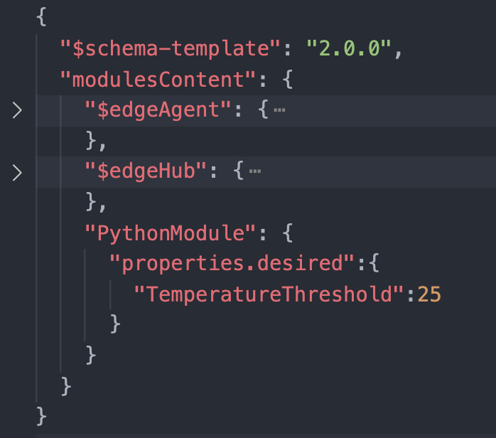
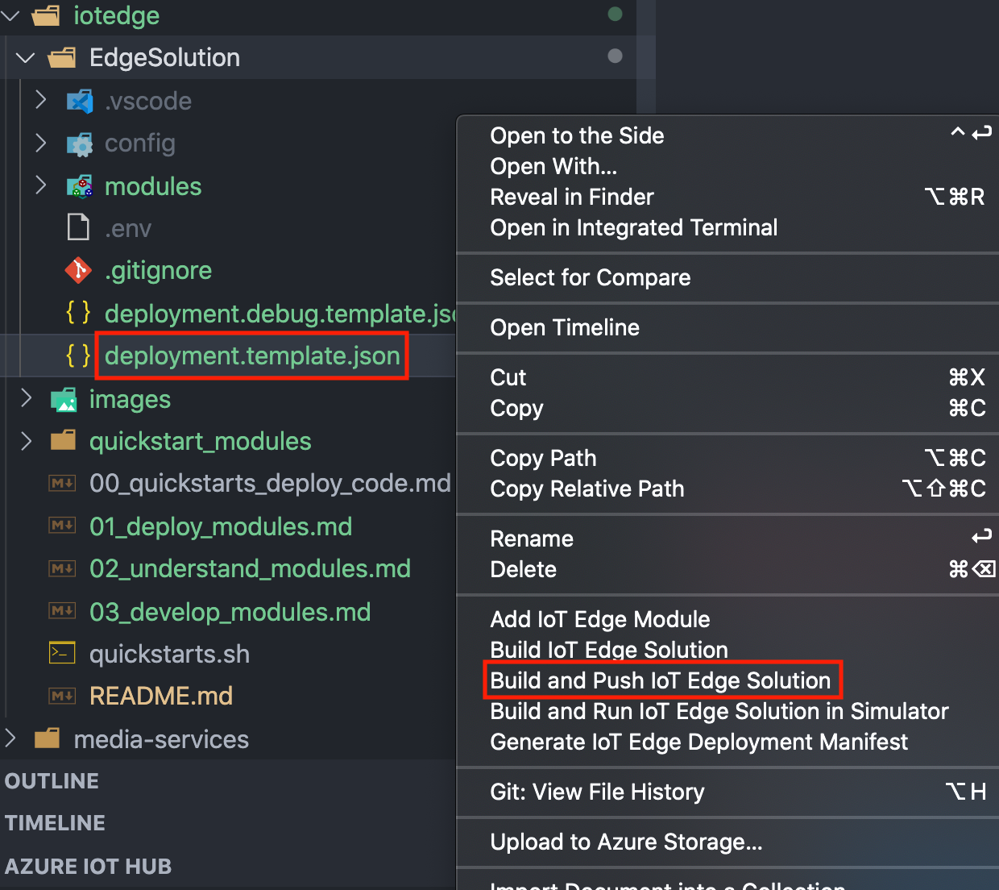
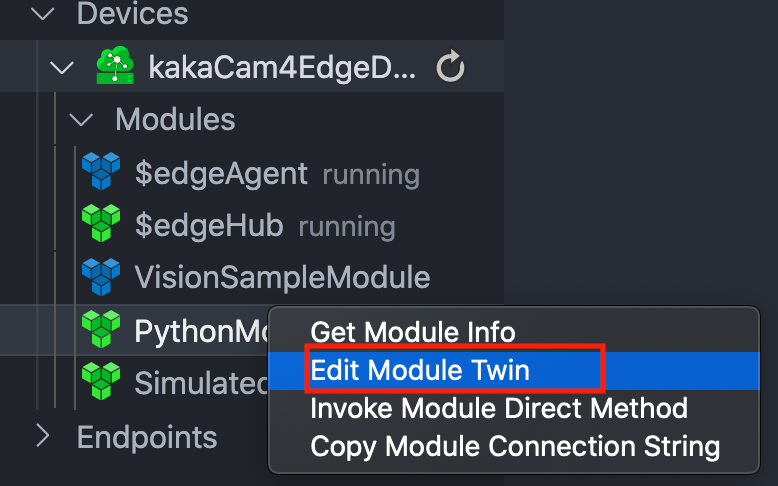
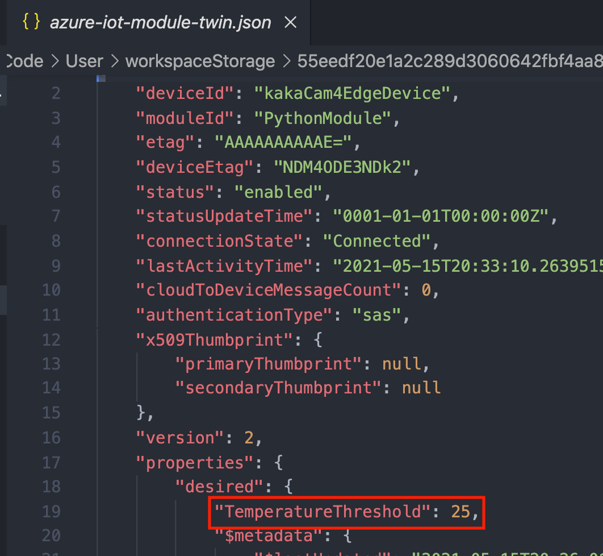
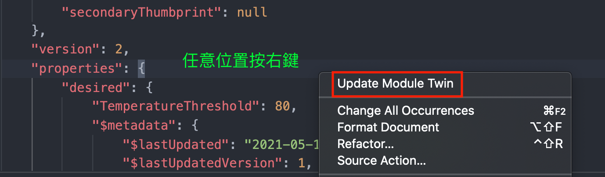
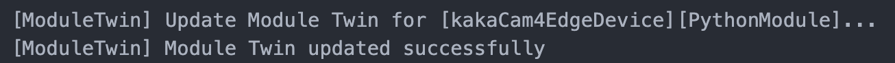

# Develop and deploy a Python IoT Edge module using Linux containers

在開始本教學課程之前，您應該已經完成先前的教學課程，以設定您的開發環境以進行 Linux 容器開發： [使用 linux 容器開發 IoT Edge 模組](https://docs.microsoft.com/zh-tw/azure/iot-edge/tutorial-develop-for-linux?view=iotedge-2018-06#create-a-container-registry)。

## Create a module project

### 1. Create a new project

Create a Python solution template that you can customize with your own code.

1. 在 Visual Studio Code 中，選取 [檢視] > [命令選擇區]，以開啟 VS Code 命令選擇區
2. 在命令選擇區中，輸入並執行命令 `Azure IoT Edge：新增 IoT Edge 解決方案`。 遵循提示並提供下列資訊，以建立解決方案：

|  欄位  |  值  |
|  :---  |  :---  |
| 選取資料夾 | 選擇開發機器上可供 VS Code 建立解決方案檔案的位置。 |
| 提供解決方案名稱 | 輸入解決方案的描述性名稱或接受預設值 EdgeSolution。 |
| 選取模組範本 | 選擇 `[Python 模組]`。 |
| 提供模組名稱 | 將模組命名為 PythonModule。 |
| 提供模組的 Docker 映像存放庫 | 可以使用 [Azure Container Registry](https://docs.microsoft.com/en-us/azure/iot-edge/tutorial-develop-for-linux?view=iotedge-2018-06#create-a-container-registry) or [Docker Hub](https://docs.docker.com/docker-hub/repos/#viewing-repository-tags)|

#### Note
```
如果未將localhost:5000值取代為 registry name，
則在 建立專案範本步驟中，
.env 檔案和部署資訊清單的 registryCredentials 區段將會遺失。
```

所建立的檔案如下:

- `.vscode`: 資料夾包含名為 *launch.json* 的檔案，其可用來對模組進行偵錯。

- `modules`: 資料夾包含解決方案中每個模組的資料夾。現在，裡面應該只有 *PythonModule*，或您提供給模組的任何名稱。資料夾包含主要程式碼、模組中繼資料和數個 Docker 檔案。

- `.env`: 檔案會保有容器登錄的認證。 這些認證會與 IoT Edge 裝置共用，使其具有存取權而得以提取容器映像。

- `deployment.debug.template.json` 檔案和 `deployment.template.json 檔案`: 是`範本`，可協助您建立`部署資訊清單(deployment manifes)`。

    - `部署資訊清單(deployment manifes)`:

        會確切*定義您想要在裝置上部署的模組、模組的設定方式，以及模組要如何彼此通訊以及與雲端通訊*。 範本檔案會對某些值使用指標。 當您將範本轉換為真正的部署資訊清單時，指標便會取代為從其他解決方案檔案取得的值。 請在部署範本中找出兩個常見的預留位置：

      - `registryCredentials`:

        位址會自動填入您在建立解決方案時所提供的資訊。 不過，使用者名稱和密碼會參照 .env 檔案中所儲存的變數。 此設定是為了確保安全，因為 .env 檔案會遭到 git 忽略，但部署範本則不會。

      - `PythonModule`:

        區段中不會填入容器映像，即使您在建立解決方案時提供了映像存放庫也是一樣。 `此預留位置會指向 PythonModule 資料夾內的 module.json 檔案`。 如果您移至該檔案，就會看到 `[映像]` 欄位的確有包含存放庫，但也會包含由容器的版本和平台組成的標記值。 您可以在開發週期中手動重複版本，並且會使用本節稍候會介紹的切換器來選取容器平台。

### 2. Add your registry credentials

環境檔案會儲存容器存放庫的認證，並與 IoT Edge 執行階段共用這些認證。 `執行階段需要有這些認證才能將私人映像提取到 IoT Edge 裝置`。

IoT Edge 擴充功能會嘗試從 Azure 提取您的容器登錄認證，並將這些認證填入到環境檔案中。 請查看您的認證是否已包含其中。 如果沒有，請立即新增：

1. 在 VS Code 總管中，開啟 .env 檔案。
2. 完成 `[REGISTRY_NAME]`, `[REGISTRY_USERNAME]`, and `[REGISTRY_PASSWORD]`
3. 儲存 .env 檔案。

### 3. Select your target architecture

目前，Visual Studio Code 可開發適用於 Linux AMD64 和 Linux ARM32v7 裝置的 Python 模組。 您必須為每個解決方案都選取要作為目標的架構，因為容器是針對每個架構類型，以不同方式建置和執行。 `預設值為 Linux AMD64`。

1. 開啟命令選擇區並搜尋 `Azure IoT Edge:Set Default Target Platform for Edge Solution`，或選取`視窗底部側邊欄的捷徑圖示`。

2. 在命令選擇區中，從選項清單中選取目標架構。 針對此教學課程，我們是使用 Ubuntu 虛擬機器作為 IoT Edge 裝置，因此會保留預設 `amd64`。




### 4. Update the module with custom code

每個範本均包含範例程式碼，會從`SimulatedTemperatureSensor 模組`擷取模擬的感應器資料，再將資料路由傳送到 IoT 中樞。 在本節中，請新增程式碼來擴充 PythonModule，以便先分析訊息再傳送。

#### 1. 修改`程式碼`

```python
import json

# global counters
TEMPERATURE_THRESHOLD = 25
TWIN_CALLBACKS = 0
RECEIVED_MESSAGES = 0
```

##### 將`input1_listener`函式取代為下列程式碼：

```python
# Define behavior for receiving an input message on input1
# Because this is a filter module, we forward this message to the "output1" queue.
async def input1_listener(module_client):
    global RECEIVED_MESSAGES
    global TEMPERATURE_THRESHOLD
    while True:
        try:
            input_message = await module_client.receive_message_on_input("input1")  # blocking call
            message = input_message.data
            size = len(message)
            message_text = message.decode('utf-8')
            print ( "    Data: <<<%s>>> & Size=%d" % (message_text, size) )
            custom_properties = input_message.custom_properties
            print ( "    Properties: %s" % custom_properties )
            RECEIVED_MESSAGES += 1
            print ( "    Total messages received: %d" % RECEIVED_MESSAGES )
            data = json.loads(message_text)
            if "machine" in data and "temperature" in data["machine"] and data["machine"["temperature"] > TEMPERATURE_THRESHOLD:
                custom_properties["MessageType"] = "Alert"
                print ( "Machine temperature %s exceeds threshold %s" % (data["machine"["temperature"], TEMPERATURE_THRESHOLD))
                await module_client.send_message_to_output(input_message, "output1")
        except Exception as ex:
            print ( "Unexpected error in input1_listener: %s" % ex )

# twin_patch_listener is invoked when the module twin's desired properties are updated.
async def twin_patch_listener(module_client):
    global TWIN_CALLBACKS
    global TEMPERATURE_THRESHOLD
    while True:
        try:
            data = await module_client.receive_twin_desired_properties_patch()  #blocking call
            print( "The data in the desired properties patch was: %s" % data)
            if "TemperatureThreshold" in data:
                TEMPERATURE_THRESHOLD = data["TemperatureThreshold"]
            TWIN_CALLBACKS += 1
            print ( "Total calls confirmed: %d\n" % TWIN_CALLBACKS )
        except Exception as ex:
            print ( "Unexpected error in twin_patch_listener: %s" % ex )
```

##### 將 listeners 更新為也接聽對應項更新

```python
# Schedule task for C2D Listener
listeners = asyncio.gather(input1_listener(module_client), twin_patch_listener(module_client))

print ( "The sample is now waiting for messages. ")
```

#### 2. 修改 `deployment.template.json`

在部署資訊清單中新增`PythonModule`模組對應項。 在`moduleContent`區段底部，於`$edgeHub` 模組對應項後面插入下列 JSON 內容

```json
"PythonModule": {
    "properties.desired":{
        "TemperatureThreshold":25
    }
}
```



## Build and push your module

In the VS Code explorer, *right-click* the `deployment.template.json` file and select `Build and Push IoT Edge Solution`.

This command would:

1. creates a *new folder* in the solution called `config` that *holds the full deployment manifest*
2. run `docker build`
3. run `docker push`



## Deploy modules to device

使用 Visual Studio Code 總管和 Azure IoT Tools 擴充功能，將模組專案部署到您的 IoT Edge 裝置。 您已備妥您的案例所需的部署資訊清單，即 `config` 資料夾中的 `deployment.amd64.json` 檔案。 現在您只需選取要接收部署的裝置即可。

請參考: [Deploy Azure IoT Edge modules from Visual Studio Code](01_deploy_modules.md)

## View The generated data

1. 在 Visual Studio Code 總管中，以滑鼠右鍵按一下 IoT Edge 裝置的名稱，然後選取 `[開始監視內建事件端點]` 。
2. 或ssh登入VM，下command

   ```bash
   $ sudo iotedge logs SimulatedTemperatureSensor -f
   ```

## Edit the module twin

我們已使用部署資訊清單中的 `PythonModule` 模組對應項，設定 25 度的溫度閾值。 您可以使用模組對應項來變更此功能，而不必更新模組程式碼。

1. 在 Visual Studio Code 中，展開您 IoT Edge 裝置底下的詳細資料，以查看執行中的模組。

2. 以滑鼠右鍵按一下 `PythonModule` 並選取 `[編輯模組對應項]` 。

   

3. 在所需的屬性中尋找 `TemperatureThreshold`。 將其值變更為高於最近報告溫度 5 到 10 度的新溫度。

   

4. 儲存模組對應項檔案。

5. 以滑鼠右鍵按一下模組對應項編輯窗格中的任意位置，然後選取 `[更新模組對應項]` 。

    

    

6. 監視傳入的裝置到雲端訊息。 在新的溫度閾值送達前，您應該會看到訊息停止。
