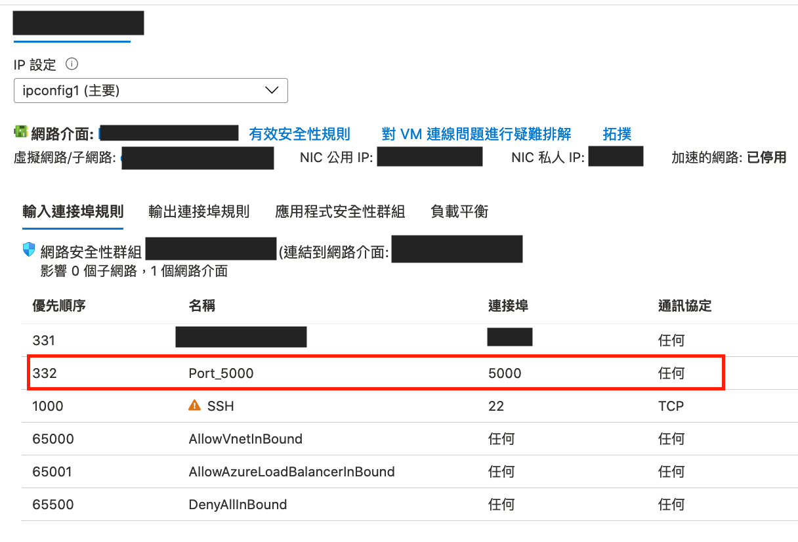
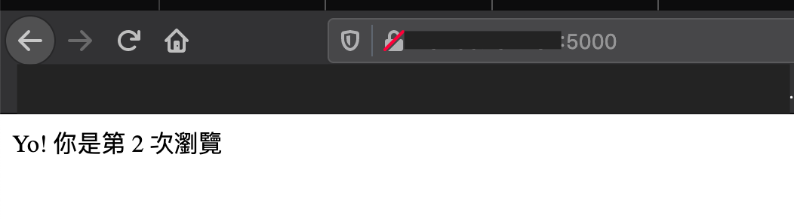

# Convert `Docker Compose` project to `Azure IoT Edge Solution` and Deploy

## 1. Install `iotedge-compose`

```bash
$ pip3 install iotedge-compose
```

## 2. Convert a `Docker Compose` project to `IoT Edge Solution`

```bash
$ iotedge-compose \
    -t project \
    -i iotedge-compose/examples/flask-redis/docker-compose.yml \
    -o iotedge-compose/examples/flask-redis-edge
```

## 3. Build and deploy converted project to IoT Edge device

Open `converted edge project` with VS Code

```
$ code iotedge-compose/examples/flask-redis-edge
```

## 4. Update the your Container Registry info.

In this example, I use `Docker Hub`


1. `.env` file

```
CONTAINER_REGISTRY_USERNAME=
CONTAINER_REGISTRY_PASSWORD=
CONTAINER_REGISTRY_ADDRESS=docker.io
```

2. `module.json`

```json
{
    "image": {
        "repository": "<YOUR_REPOSITORY_NAME>/web",
        "tag": {
            "version": "0.0.1",
            "platforms": {
                "amd64": "Dockerfile"
            }
        },
    }
}
```

Example, In my case:

```json
{
    "image": {
        "repository": "kakalin/web",
        "tag": {
            "version": "0.0.1",
            "platforms": {
                "amd64": "Dockerfile"
            }
        },
    }
}
```

## 5. Deploy modules to Azure IoT Edge

- [Deploy Azure IoT Edge modules from Visual Studio Code](https://github.com/kaka-lin/azure-notes/blob/master/iotedge/01_deploy_modules.md)

## 6. Expose VM's port

When Deployment succeeded, don't forget to expose yor vm's port, like:



## 7. Result

If you can access the IoT Edge device via public IP with port 5000 allowed,
the demo page can be visited in your browser with `http://<IoTEdgeDeviceAddress>:5000/`


