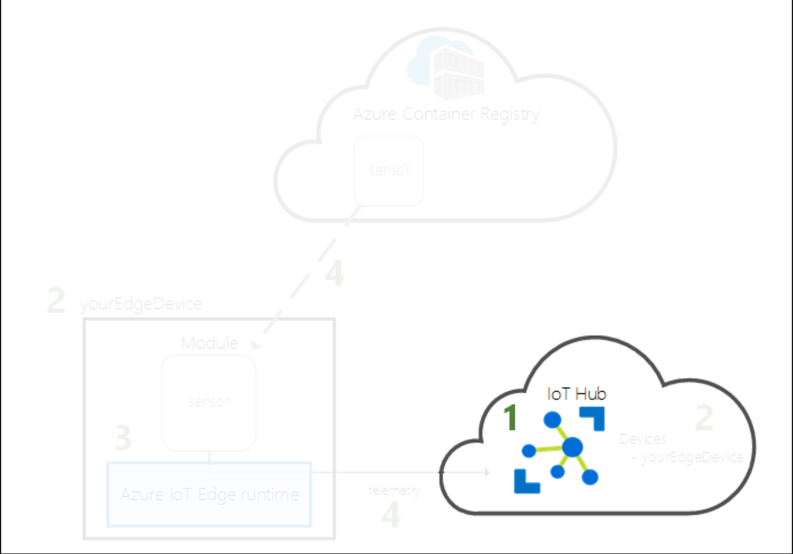
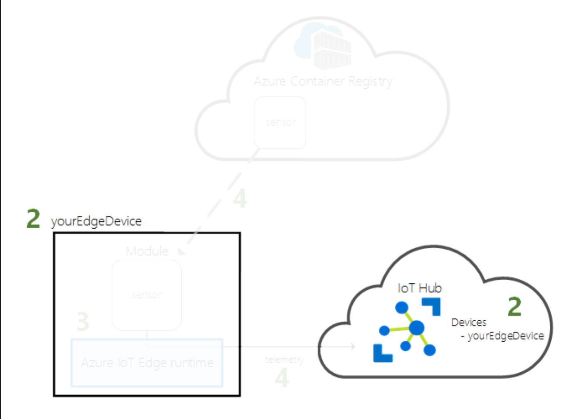
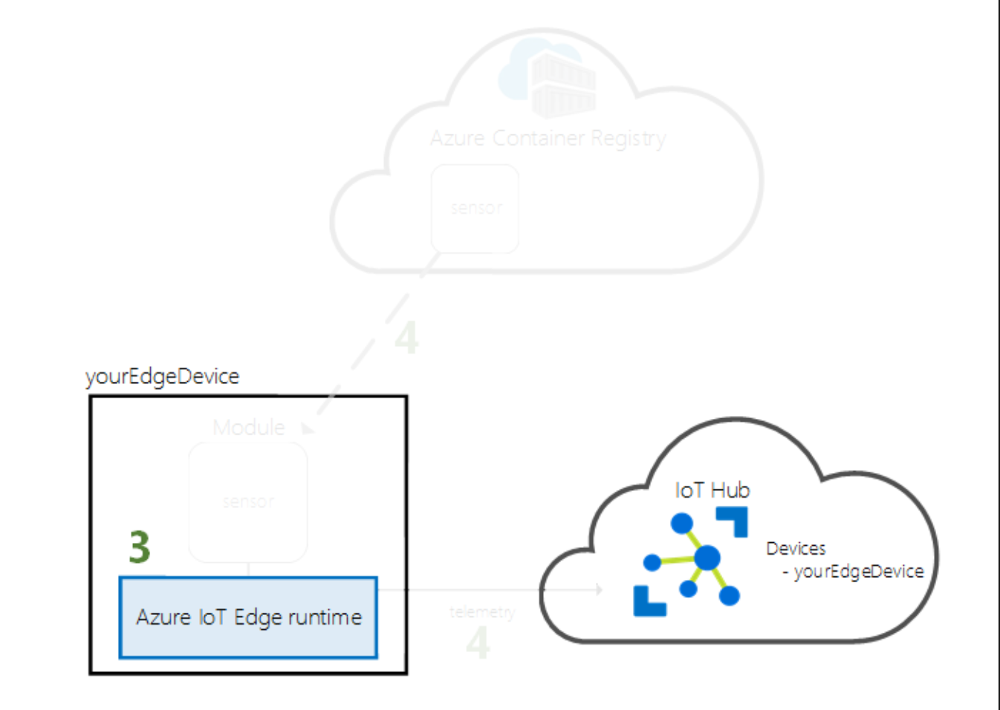
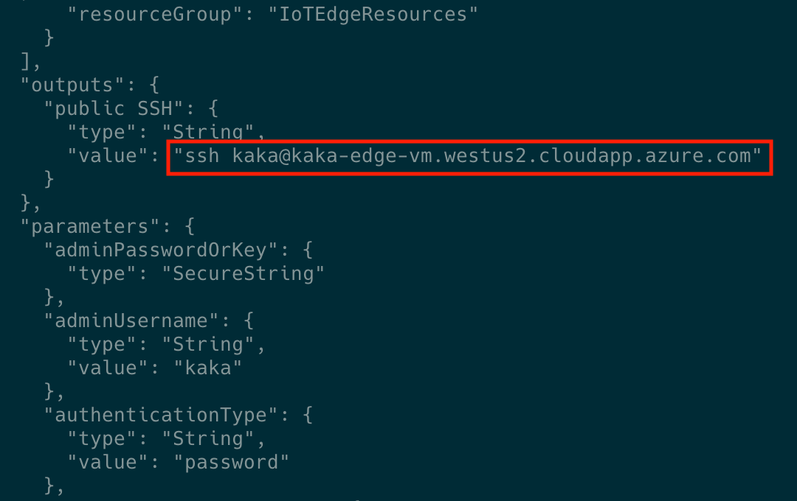
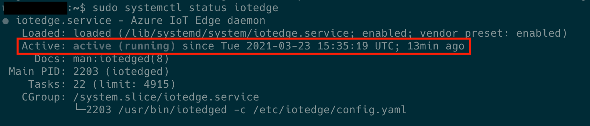
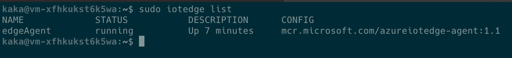
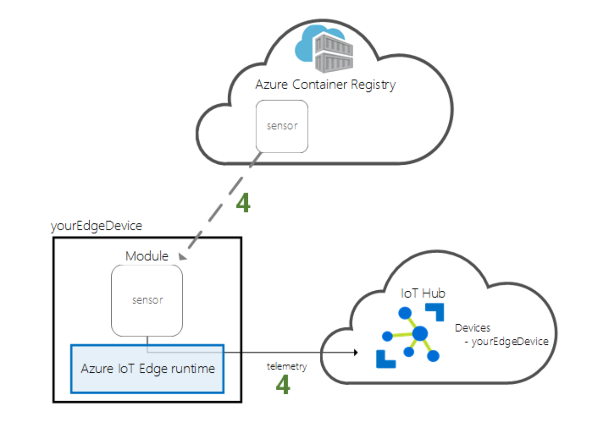
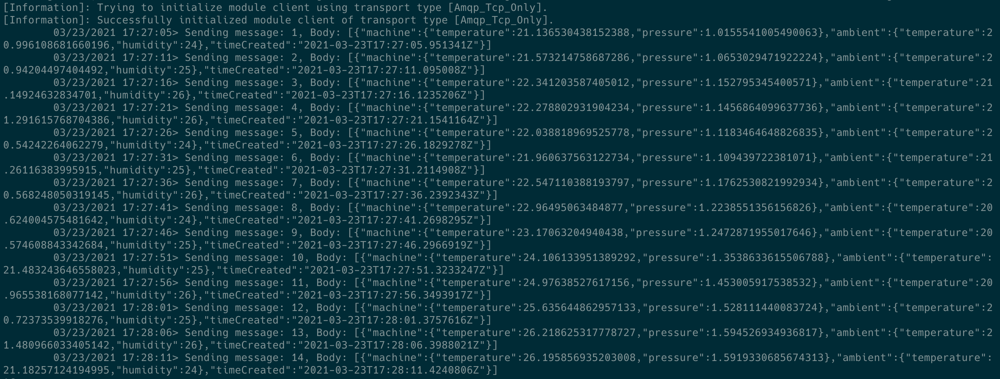

# Quickstarts: Deploy code to a Linux device

[Quickstart: Deploy your first IoT Edge module to a virtual Linux device](https://docs.microsoft.com/en-us/azure/iot-edge/quickstart-linux?view=iotedge-2018-06)

## 1. Install the Azure CLI

[Install the Azure CLI](https://docs.microsoft.com/en-us/cli/azure/install-azure-cli)

 - macOS

    - Azure CLI

        ```bash
        $ brew update && brew install azure-cli
        ```

    - Azure IoT CLI Extension

        ```bash
        $ az extension add --name azure-iot
        ```

### Login

```bash
$ az login
```

## 2. Create Cloud resources

A resource group to manage all the resources you use in this section

```bash
$ az group create --name IoTEdgeResources --location westus2
```

## 3. Create an IoT hub



The following code creates a `free F1 hub` in the resource group `IoTEdgeResources`. Replace {hub_name} with a unique name for your IoT hub. It might take a few minutes to create an IoT Hub.


```bash
$ az iot hub create --resource-group IoTEdgeResources --name {hub_name} --sku F1 --partition-count 2

# Exmaple
az iot hub create --resource-group IoTEdgeResources --name kakaiothub --sku S1 --partition-count 2
```

- Note: *If you get an error because there's already one free hub in your subscription, change the SKU to S1.*

## 4. Register an IoT Edge device



Create a `device identity` for your IoT Edge device so that it can communicate with your IoT hub. The device identity lives in the cloud, and you use a `unique device connection string` to *associate a physical device to a device identity.*

### 4-1.  Create and declare device identify to be for an IoT Edge device

Since IoT Edge devices behave and can be managed differently than typical IoT devices, *declare this identity to be for an IoT Edge device* with the `--edge-enabled` flag.

```bash
$ az iot hub device-identity create --device-id {myEdgeDevice} --edge-enabled --hub-name {hub_name}

# Example
$ az iot hub device-identity create --device-id kakaEdgeDevice --edge-enabled --hub-name kakaiothub
```

## 4-2. View the connection string

View the `connection string` for your device, which links your physical device with its identity in IoT Hub.

`connection string` contains:

- the name of your IoT hub
- the name of your device
- a shared key that authenticates connections between the two

```bash
$ az iot hub device-identity connection-string show --device-id {myEdgeDevice} --hub-name {hub_name}

# Example
$ az iot hub device-identity connection-string show --device-id kakaEdgeDevice --hub-name kakaiothub
```

Output:

```bash
{
  "connectionString": "HostName={hub_name}.azure-devices.net;DeviceId={myEdgeDevice};SharedAccessKey={key}"
}
```

## 5. Configure your IoT Edge device

*Create a virtual machine with the Azure IoT Edge runtime on it.*



The `IoT Edge runtime` is deployed on all IoT Edge devices.

It has three components:

- `The IoT Edge security daemon`: starts each time an IoT Edge device boots and bootstraps the device by starting the IoT Edge agent.

- `The IoT Edge agent`: facilitates deployment and monitoring of modules on the IoT Edge device, including the IoT Edge hub.

- `The IoT Edge hub`: manages communications between modules on the IoT Edge device, and between the device and IoT Hub.

During the runtime configuration, you provide a `device connection string`. This string associates your physical device with the IoT Edge device identity in Azure.

### 5-1. Deploy the IoT Edge device (Create VM and install IoT Edge runtime)

This section uses an `Azure Resource Manager template` to *`create a new virtual machine and install the IoT Edge runtime`* on it.

Use the following CLI command to create your IoT Edge device based on the prebuilt [iotedge-vm-deploy](https://github.com/Azure/iotedge-vm-deploy) template.

template: [iotedge-vm-deploy/edgeDeploy.json](https://github.com/Azure/iotedge-vm-deploy/blob/master/edgeDeploy.json)

```bash
$ az deployment group create \
--resource-group IoTEdgeResources \
--template-uri "https://aka.ms/iotedge-vm-deploy" \
--parameters dnsLabelPrefix='<REPLACE_WITH_VM_NAME>' \
--parameters adminUsername='azureUser' \
--parameters deviceConnectionString=$(az iot hub device-identity connection-string show --device-id myEdgeDevice --hub-name <REPLACE_WITH_HUB_NAME> -o tsv) \
--parameters authenticationType='password' \
--parameters adminPasswordOrKey="<REPLACE_WITH_PASSWORD>"

# Example
$ az deployment group create \
--resource-group IoTEdgeResources \
--template-uri "https://aka.ms/iotedge-vm-deploy" \
--parameters dnsLabelPrefix='kaka-edge-vm1' \
--parameters adminUsername='azureUser' \
--parameters deviceConnectionString=$(az iot hub device-identity connection-string show --device-id kakaEdgeDevice --hub-name kakaiothub -o tsv) \
--parameters authenticationType='password' \
--parameters adminPasswordOrKey="password"
```

*Once the deployment is complete, you should receive JSON-formatted output in the CLI that contains the SSH information to connect to the virtual machine. Copy the value of the public SSH entry of the outputs section:*




### 5-2. View the IoT Edge runtime status

*The rest of the commands in this quickstart take place on your IoT Edge device itself, so that you can see what's happening on the device.*

```bash
$ ssh {admin username}@{DNS name}
```

Once connected to your virtual machine, verify that the runtime was successfully installed and configured on your IoT Edge device.

1. Check to see that the IoT Edge security daemon is running as a system service.

    ```bash
    $ sudo systemctl status iotedge
    ```

    

2. If you need to troubleshoot the service, retrieve the service logs.

    ```bash
    $ journalctl -u iotedge
    ```

3. View all the modules running on your IoT Edge device. *The edgeAgent module runs by default.*

    ```bash
    $ sudo iotedge list
    ```

    

    Note:

    > You should only have `edgeAgent` and `edgeHub` before you deploy `SimulatedTemperatureSensor` module

## 6. Deploy a module

*Manage your Azure IoT Edge device from the cloud to deploy a module that will send telemetry data to IoT Hub.*



One of the `key capabilities of Azure IoT Edge` is deploying code to your IoT Edge devices from the cloud. `IoT Edge modules` are executable packages implemented as containers.

Tutorials: [Deploy a module from the cloud](https://docs.microsoft.com/en-us/azure/iot-edge/quickstart-linux?view=iotedge-2018-06#deploy-a-module)

## 7. View generated data

*Use the SSH connection from Azure CLI. Confirm that the module deployed from the cloud is running on your IoT Edge device*

```bash
$ sudo iotedge list
```


View the messages being sent from the temperature sensor module:

```bash
$ sudo iotedge logs SimulatedTemperatureSensor -f
```



## 8. Clean up resources

```bash
$ az group delete --name IoTEdgeResources --yes
```

You can confirm the resource group is removed by viewing the list of resource groups.

```bash
$ az group list
```
